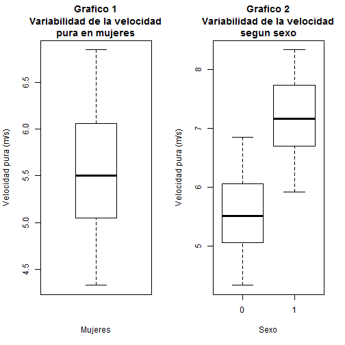
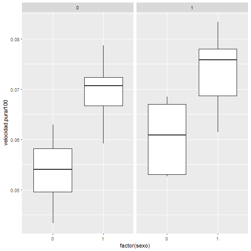

```{r setup, include=FALSE}
knitr::opts_chunk$set(fig.width = 5, fig.height = 4, message = FALSE, warning = FALSE)
```


# Principios de gráficos analíticos

## ¿Para qué sirven los gráficos?

Los gráficos son usados, fundamentalmente, para mostrar resultados derivados de los conjuntos de datos de forma ordenada y estructurada, para así hacerlos más interpretables y convincentes. Edward Tufe menciona seis principios en su libro del 2006: Beautiful Evidence.

## Primer principio: Comparaciones



## segundo principio: Causalidad o estructura interna



- Distribución de los datos / Pregunta de investigación

## Tercer principio: Datos multivariados

- Por lo general, los textos utilizan el término de "datos multivariados" cuando se tiene más de 2 variables.
- Contar con conjuntos de datos multivariados tiene muchas ventajas, pero, por lo general, las preguntas relacionadas a estos datos son más complicados y requieren de un mayor razonamiento.
- Restringirse a solo algunas variables (por ejemplo, dos) puede hacer que lleguemos a conclusiones inadecuadas por falta de información. Por lo tanto, vale la pena utilizar la mayor cantidad de variable posibles.
- Para el caso anterior, se recomiendo hacer varios gráficos o, por defecto, un único gráfico con paneles y colores diferentes para mostrar información de variables distintas.

## Cuarto principio: Integración

- No nos debemos limitar a una sola forma de expresión.
- Se pueden usar palabras, números, imágenes y diagramas.
- Los gráficos deben hacer uso de varias formas de presentación de los datos.

Veamos un ejemplo:

[https://jamanetwork.com/journals/jama/fullarticle/181898](https://jamanetwork.com/journals/jama/fullarticle/181898)

## Quinto principio: Documentación

- Describir y documentar los gráficos con las fuentes, etiquetas y escalas adecuadas.
- Los gráficas que se crean a partir de los datos deben contar una historia completa de la investigación (es decir, deben dar credibilidad).
- Se debe conservar cualquier código que se utilice para generar los datos y gráficos de manera que la investigación pueda ser replicada. Esto permite una fácil verificación de los resultados y se pueden hallar posibles errores en el análisis.

## Sexto principio: Contenido

- En resumen, el contenido lo es todo.
- Las presentaciones, en última instancia, dependen de la calidad, relevancia e integridad del contenido presentado.

# Gráficos en R

## Medios gráficos en R

En R, hay una gran variedad de tipos de medios gráficos, cada uno con sus características particulares. Algunos ejemplos son PDF, PNG, JPEG, SVG y TIFF.

```{r, echo=F}
plot(cars$speed, cars$dist)
```

## Sistemas gráficos en R

- `base`
- `lattice`
- `ggplot2`

## Sistema gráfico `base`

Contiene funciones para gráficos elementales.

```{r}
boxplot(cars, main = "Título", xlab = "X", ylab = "Y")
```

## Sistema gráfico `base`

```{r}
names(par())
```

## Sistema gráfico `base`

```{r}
par("fg") # Da el color del primer plano

par('pch') # Da el tipo de línea y el ancho

par("lty") # Puede ser dashed, dotted, etc.
```

## Sistema gráfico `lattice`

- No trabaja en dos fases.
- Toma una fórmula como su primer argumento, por lo general de la forma `y ~ x`

## Sistema gráfico `lattice`

```{r}
library(lattice)
xyplot(Sepal.Length ~ Sepal.Width | Species, data = iris)
```

## Sistema gráfico `ggplot2`

- Tiene 2 funciones muy importantes. La función básica es `qplot()` (quick plot o gráfico rápido), la cual funciona más o menos como `plot` en el sistema base.
- La función más avanzada en el paquete es `ggplot()`, que es más flexible y se puede personalizar para hacer las cosas que `qplot()` no puede.

## Sistema gráfico `ggplot2`

```{r}
library(ggplot2)
qplot(displ, hwy, data = mpg, geom = c("point", "smooth"), facets = . ~ drv)
```

## Sistema gráfico `ggplot2`

```{r}
g <- ggplot(mpg, aes(displ, hwy))
g + geom_point() +
  geom_smooth(method = "lm") + # Para agregar una línea
  facet_grid(. ~ drv) + # Se divide en columnas
  ggtitle("Título")
```

# Gráficos interactivos

## El paquete `leaflet`

La función `leaflet()` crea un mapa que se almacena en una variable, por lo que, posteriormente, puede ser modificada. La función `addTiles()` agrega datos de los mapas del sitio [Open Street Map](https://www.openstreetmap.org).

## El paquete `leaftlet`

```{r}
library(leaflet)
mi_mapa <- leaflet() %>%
            addTiles()
mi_mapa
```

## El paquete `leaftlet`

Es posible añadir marcadores al mapa utilizando la función `addMarkers()` especificando la latitud y la longitud. Además, es posible agregar etiquetas a estos mismos marcadores.

## El paquete `leaftlet`

```{r}
mi_mapa <- mi_mapa %>%
          addMarkers(lat = 9.937059, lng = -84.051896,
                     popup = "Usted está aquí")
mi_mapa
```

## El paquete `leaflet`

Por lo general, no es eficiente añadir un marcador a la vez al mapa. Por lo tanto, si se desea agergar varios marcadores a la vez, se puede hacer usando un `data.frame` cuyas columnas sean `lat` y `lng` (latitud y longitud, respectivamente). De esta forma, se pueden agregar todos los marcadores de una sola vez.

## El paquete `leaflet`

```{r}
set.seed(2017-02-02)
df <- data.frame(lat = runif(20, min = 9.93, max = 9.95),
                 lng = runif(20, min = -84.03, max = -84.01))
df %>% leaflet() %>% 
  addTiles() %>% 
  addMarkers()
```

## El paquete `leaflet`

También es posible modificar el tipo de marcador:

```{r}
icono<- makeIcon(
  iconUrl = "https://fotos.subefotos.com/5142ea1e0297bbec97530d6989e0700bo.jpg",
  iconWidth = 31 * 215 / 230, iconHeight = 31,
  iconAnchorX = 31 * 215 / 230 / 2, iconAnchorY = 16
)

df %>% 
  leaflet() %>% 
  addTiles() %>% 
  addMarkers(lat = 9.937059, lng = -84.051869,
             popup = "Que chiva...", icon = icono)
```

## El paquete `leaflet`

Algunas veces es necesario marcar varios puntos en el mapa, pero no tiene sentido usar todos los marcadores al mismo tiempo, sino usar algún tipo de agrupamiento.

## El paquete `leaflet`

```{r}
df<-data.frame(lat = runif(20, min = 9.93, max = 9.95),
               lng = runif(20, min = -84.03, max = -84.01))
df %>% 
  leaflet() %>%
  addTiles() %>%
  addMarkers(clusterOptions = markerClusterOptions())
```

## El paquete `leaflet`

Aparte de añadir marcadores simples o agrupados, también se puede añadir, de forma sencilla, marcadores circulaes mediante la función `addCircleMarkers()`.

## El paquete `leaftlet` 

```{r}
df<-data.frame(lat = runif(20, min = 9.93, max = 9.95),
               lng = runif(20, min = -84.03, max = -84.01))
df %>% 
  leaflet() %>%
  addTiles() %>%
  addCircleMarkers()
```

## El paquete `leaftlet`

Pueden dibujarse formas arbitrarias en los mapas creados, incluyendo círuclos y cuadrados. El código de la siguiente diapositiva dibuja un mapa donde el círculo en cada ciudad es proporcional a la población de la misma.

## El paquete `leaflet`

```{r}
ciudades<-data.frame(name = c("Baltimore", "Frederick", "Rockville", "Gaithersburg", 
                                 "Bowie", "Hagerstown", "Annapolis", "College Park", "Salisbury", "Laurel"),
                        pob = c(619493, 66169, 62334, 61045, 55232,
                                39890, 38880, 30587, 30484, 25346),
                        lat = c(39.2920592, 39.4143921, 39.0840, 39.1434, 39.0068, 39.6418, 38.9784, 38.9897, 38.3607, 39.0993),
                        lng = c(-76.6077852, -77.4204875, -77.1528, -77.2014, -76.7791, -77.7200, -76.4922, -76.9378, -75.5994, -76.8483))
ciudades %>%
  leaflet() %>%
  addTiles() %>%
  addCircles(weight = 1, radius = sqrt(ciudades$pob) * 30)
```

## El paquete `leaflet`

Los rectángulos también aparecen en los mapas de `leaftlet`

```{r}
leaflet() %>% 
  addTiles() %>% 
  addRectangles(lat1 = 37.3858, lng1 = -122.0595, 
                lat2 = 37.3890, lng2 = -122.0625) 
```

## El paquete `leaflet`

```{r}
df<- data.frame(lat = runif(20, min = 39.25, max = 39.35),
                 lng = runif(20, min = -76.65, max = -76.55),
                 col = sample(c("red", "blue", "green"), 20, replace = TRUE),
                 stringsAsFactors = FALSE)

df %>%
  leaflet() %>%
  addTiles() %>%
  addCircleMarkers(color = df$col) %>%
  addLegend(labels = LETTERS[1:3], colors = c("blue", "red", "green"))
```

## El paquete `highcharter`

El paquete `highcharter`, basada en un paquete de *JavaScript* del mismo nombre, es bastante reciente en R y permite hacer gráficos interactivos de muchas formas. La página oficial y la documentación del paquete están en el sitio [http://jkunst.com/highcharter/hchart.html](http://jkunst.com/highcharter/hchart.html). Veamos un ejemplo del mapa de desempleo de EEUU, tomado directamente del sitio oficial.

## El paquete `highcharter`

```{r, results = 'asis', cache = T}
library(dplyr)
library(highcharter)

hcmap("countries/us/us-all-all", data = unemployment,
      name = "Unemployment", value = "value", joinBy = c("hc-key", "code"),
      borderColor = "transparent") %>%
  hc_colorAxis(dataClasses = color_classes(c(seq(0, 10, by = 2), 50))) %>% 
  hc_legend(layout = "vertical", align = "right",
            floating = TRUE, valueDecimals = 0, valueSuffix = "%") 
```

